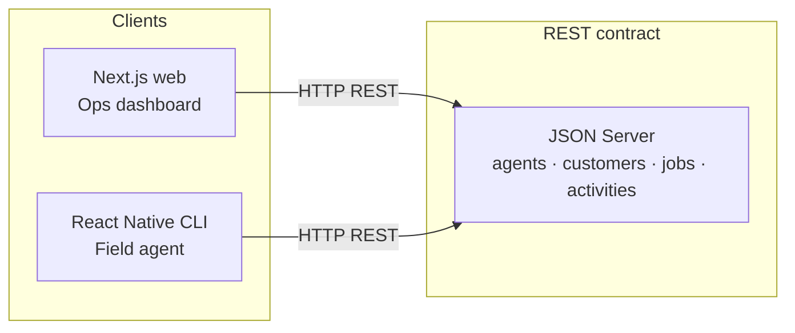

# OpsFlow — POC Presentation Pack (Phase 12)

## One-minute story

> I built **OpsFlow** as a service-operations platform to demonstrate production-oriented frontend and mobile engineering. The web app uses Next.js, TypeScript, and Tailwind, with Redux Toolkit managing state and a REST API for data. The dashboard handles large datasets with search, filtering, sorting, pagination, and analytics. A React Native CLI companion app serves field agents on the same API contract. The backend is intentionally lightweight (JSON Server) so the POC focuses on frontend architecture, performance, reusable components, and independent product development.

---

## Live links

| Asset | URL | Status |
|-------|-----|--------|
| GitHub repository | _add after push_ | Pending host account |
| Web (Vercel) | _add after deploy_ | Config ready — see [DEPLOYMENT.md](./DEPLOYMENT.md) |
| Public API (Render) | _add after deploy_ | Blueprint ready — `render.yaml` |
| Mobile | Local demo / screenshots | No store publish |

Update this table once Vercel + Render URLs exist.

---

## Architecture (high level)

Details: [ARCHITECTURE.md](./ARCHITECTURE.md) · decisions: [DECISIONS.md](./DECISIONS.md)

---

## Demo script (≈8 minutes)

1. **Web — Dashboard** — KPIs + charts from count queries + sample (ADR-018).  
2. **Jobs** — search, filters drawer, sort, pagination, open details, create/edit.  
3. **Agents / Customers** — list + drawer + related jobs.  
4. **Analytics** — date range + distributions.  
5. **Mobile** — FlatList jobs for `agent-001`, pull-to-refresh, status bottom sheet.  
6. **Engineering** — Redux slices, CI (`npm run ci`), performance notes, ADRs.

---

## Screenshots / video checklist

Capture into [`docs/screenshots/`](./screenshots/README.md):

- [ ] Web dashboard  
- [ ] Jobs table (with filters)  
- [ ] Job details drawer  
- [ ] Agents list + detail  
- [ ] Customers list + detail  
- [ ] Analytics  
- [ ] Mobile jobs list  
- [ ] Mobile job details + status sheet  
- [ ] Optional: short mobile screen recording  

---

## Supporting docs (already in repo)

| Doc | Covers |
|-----|--------|
| [PROJECT_SPEC.md](./PROJECT_SPEC.md) | Full product + phase plan |
| [ARCHITECTURE.md](./ARCHITECTURE.md) | System design |
| [DECISIONS.md](./DECISIONS.md) | ADRs |
| [PERFORMANCE.md](./PERFORMANCE.md) | Phase 8 evidence |
| [TESTING.md](./TESTING.md) | Vitest / Playwright / Jest |
| [CI.md](./CI.md) | Local gate + GitHub Actions |
| [DEPLOYMENT.md](./DEPLOYMENT.md) | Vercel + Render steps |
| [api/README.md](../api/README.md) | API contract |

---

## Definition of Done (Phase 12)

- [x] Deployment instructions + platform configs committed  
- [ ] GitHub remote created / pushed (requires your account)  
- [ ] Public API live + verified with curl  
- [ ] Web deployed with `NEXT_PUBLIC_API_BASE_URL` pointing at public API  
- [x] README + presentation pack updated  
- [ ] Screenshots / mobile video captured locally  
